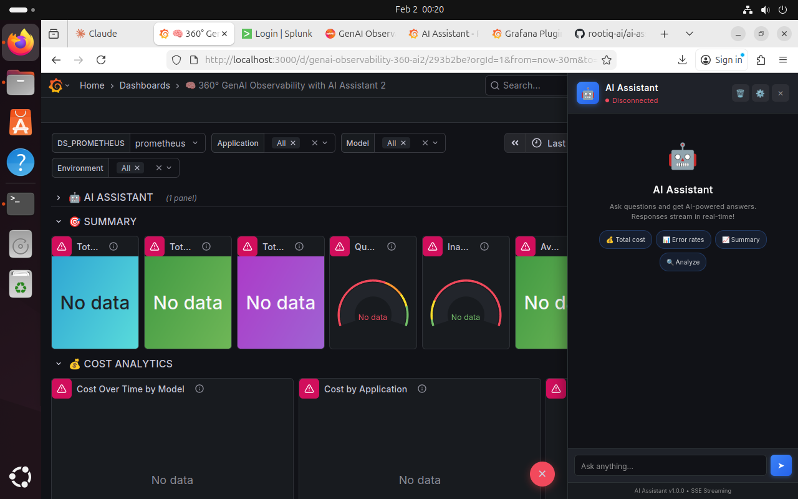

# MCP Assistant - Grafana Plugin

[](https://grafana.com)
[](LICENSE)
[](https://github.com/kamalsinghbisht/mcp-assistant-app/releases)

**Universal AI chatbot sidebar for Grafana** that connects to any MCP (Model Context Protocol) server with real-time SSE streaming.



## Features

- **Universal MCP Client** - Connect to any MCP server
- **SSE Streaming** - ChatGPT-like real-time response streaming
- **Inline Charts** - Visualizations rendered directly in chat
- **Beautiful Dark Theme** - Matches Grafana's aesthetics
- **Floating Sidebar** - Accessible on every Grafana page
- **Keyboard Shortcuts** - Quick access with Ctrl+B
- **Clear Chat** - One-click conversation reset
- **Easy Configuration** - Simple MCP server URL setup

## Installation

### From Grafana CLI (Coming Soon)

```bash
grafana-cli plugins install mcp-assistant-app
```

### Manual Installation

1. **Download** the latest release from [GitHub Releases](https://github.com/kamalsinghbisht/mcp-assistant-app/releases)

2. **Clone** to your Grafana plugins directory:
   ```bash
   git clone https://github.com/rootiq-ai/mcp-assistant-app.git
   cd mcp-assistant-app
   ```
3. **Build the Plugin**
   ```bash
   npm install
   npm run build
   ```
4. **Copy to Grafana Plugins Folder**
   ```bash
   sudo cp -r dist /var/lib/grafana/plugins/mcp-assistant-app
   sudo chown -R grafana:grafana /var/lib/grafana/plugins/mcp-assistant-app
   ```
6. **Configure** Grafana to allow unsigned plugins (for development):
   ```ini
   # /etc/grafana/grafana.ini
   [plugins]
   allow_loading_unsigned_plugins = mcp-assistant-app
   ```
7. **Restart** Grafana:
   ```bash
   sudo systemctl restart grafana-server
   ```
8. **Enable** the plugin:
   - Open http://localhost:3000/plugins
   - Search "MCP Assistant"
   - Click on it → Enable
9. **Verify**
    - Hard refresh browser: Ctrl + Shift +
    - You should see the 🤖 blue button (bottom-right corner) in dashboard
    - Click it to open the sidebar!
## Quick Start

1. **Start your MCP server**:

2. **Open Grafana** and click the **🤖 blue button** in the bottom-right corner

3. **Configure** the MCP server URL in settings (default: `https://localhost:3001`)

4. **Ask questions** in natural language!

## Configuration

Click the **⚙️ Settings** button in the sidebar header:

| Setting | Description | Default |
|---------|-------------|---------|
| MCP Server URL | URL of your MCP server | `http://localhost:3001` |

## MCP Server Requirements

Your MCP server should implement these endpoints:

| Endpoint | Method | Description |
|----------|--------|-------------|
| `/health` | GET | Health check (returns `{ "status": "healthy" }`) |
| `/stream` | GET | SSE streaming endpoint |
| `/query` | POST | HTTP fallback endpoint |

### SSE Response Format

```
data: {"token": "Hello"}
data: {"token": " world"}
data: {"chart": "base64..."}
data: {"done": true}
```

### HTTP Response Format

```json
{
  "answer": "Response text",
  "chart": "base64..."
}
```

## Keyboard Shortcuts

| Shortcut | Action |
|----------|--------|
| `Ctrl + B` | Toggle sidebar |
| `Enter` | Send message |
| `Shift + Enter` | New line in input |

## Development

### Prerequisites

- Node.js 18+
- npm or yarn

### Build from Source

```bash
# Clone repository
git clone https://github.com/kamalsinghbisht/mcp-assistant-app.git
cd mcp-assistant-app

# Install dependencies
npm install

# Build for production
npm run build

# Development mode (watch)
npm run dev
```

### Project Structure

```
mcp-assistant-app/
├── src/
│   ├── module.ts           # Plugin entry point
│   ├── plugin.json         # Plugin metadata
│   ├── components/
│   │   ├── App.tsx         # Configuration page
│   │   └── Sidebar.ts      # Main sidebar + SSE
│   └── img/
│       └── logo.svg        # Plugin icon
├── dist/                   # Built plugin
├── package.json
├── tsconfig.json
├── webpack.config.js
├── README.md
├── CHANGELOG.md
└── LICENSE
```

## Troubleshooting

### Sidebar not appearing

1. Ensure the plugin is **enabled** in Grafana
2. Check that `preload: true` is in `plugin.json`
3. Hard refresh the browser: `Ctrl + Shift + R`
4. Check browser console for errors

### "Disconnected" status

1. Verify your MCP server is running
2. Check the server URL in settings
3. Ensure CORS is properly configured on your MCP server:
   ```python
   # FastAPI example
   app.add_middleware(
       CORSMiddleware,
       allow_origins=["*"],
       allow_methods=["*"],
       allow_headers=["*"],
   )
   ```

### SSE not streaming

1. Check if `/stream` endpoint returns `Content-Type: text/event-stream`
2. Verify SSE response format matches expected structure
3. Check browser Network tab for connection issues

## Contributing

Contributions are welcome! Please feel free to submit a Pull Request.

1. Fork the repository
2. Create your feature branch (`git checkout -b feature/amazing-feature`)
3. Commit your changes (`git commit -m 'Add amazing feature'`)
4. Push to the branch (`git push origin feature/amazing-feature`)
5. Open a Pull Request

## 📄 License

This project is licensed under the Apache License 2.0 - see the [LICENSE](LICENSE) file for details.

## Author

**Kamal Singh Bisht**

- GitHub: [@kamalsinghbisht](https://github.com/kamalsinghbisht)
- LinkedIn: [Kamal Singh Bisht](https://linkedin.com/in/kamalsinghbisht)

## Acknowledgments

- [Grafana](https://grafana.com) - Amazing observability platform
- [Model Context Protocol](https://modelcontextprotocol.io) - MCP specification
- [Anthropic](https://anthropic.com) - Claude AI

## Related Projects

- [GenAI Observability Splunk App](https://splunkbase.splunk.com) - Splunk version
- [genai-telemetry SDK](https://pypi.org/project/genai-telemetry/) - Python SDK for GenAI telemetry

---

Made with ❤️ for the observability community
